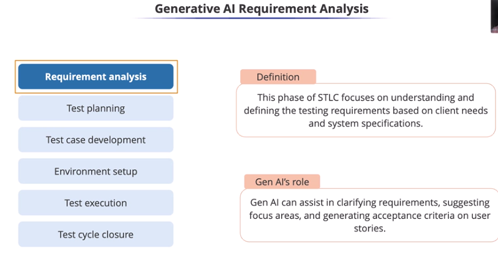
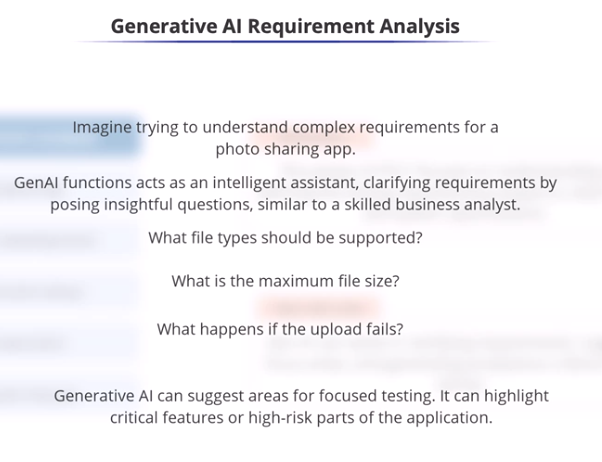
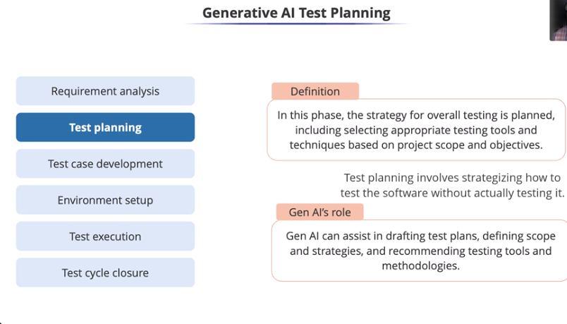
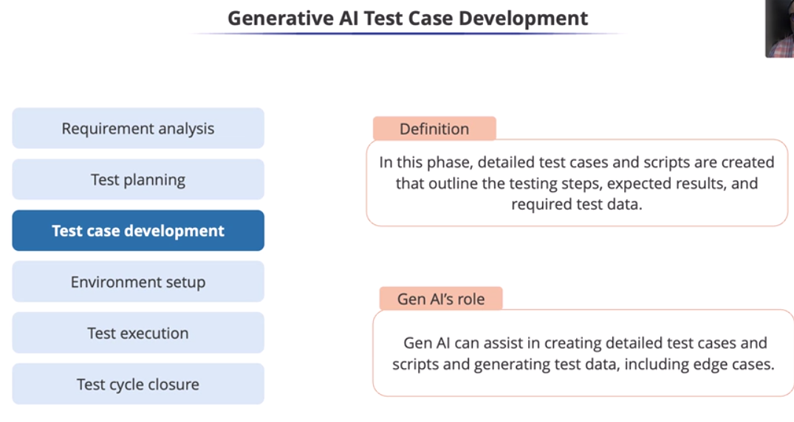
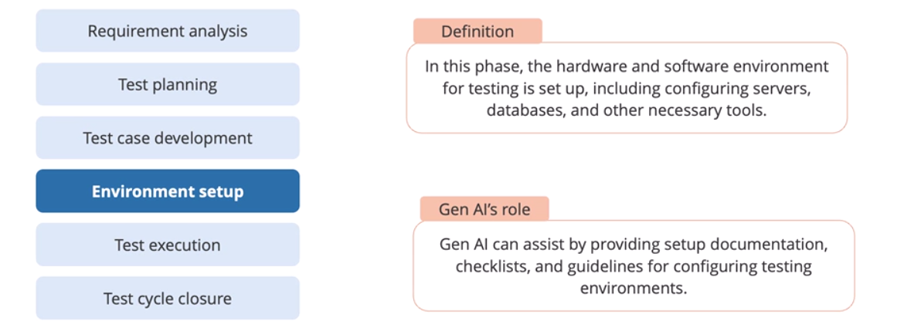
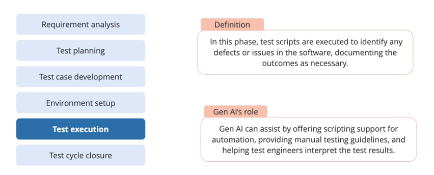
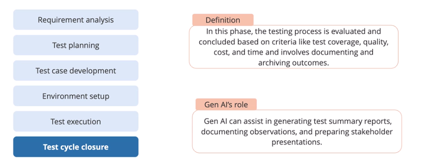

# Steps in Software Testing Life cycle

## Requirement Analysis

## Test planning

## Test case development

## Environment Setup

## Test Execution

## Test cycle Closure

GenAl can create compelling presentations that clearly communicate testing
outcomes, app quality, and recommendations for next steps.

In Test Cycle Closure, generative Al acts as a reporting and documentation
assistant, summarizing testing efforts, communicating results, and
capturing insights for future improvements.