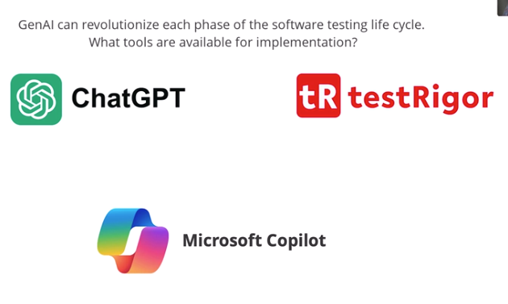

# Frequently Used GenAI Tools in Software testing

In testing, Copilot helps developers write unit tests and
assists testers with test automation and scripting,
enabling faster and more efficient code writing.