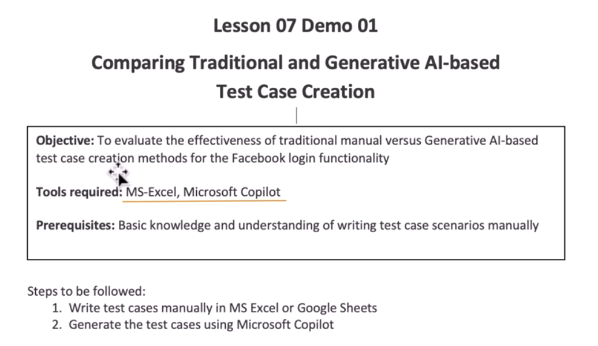
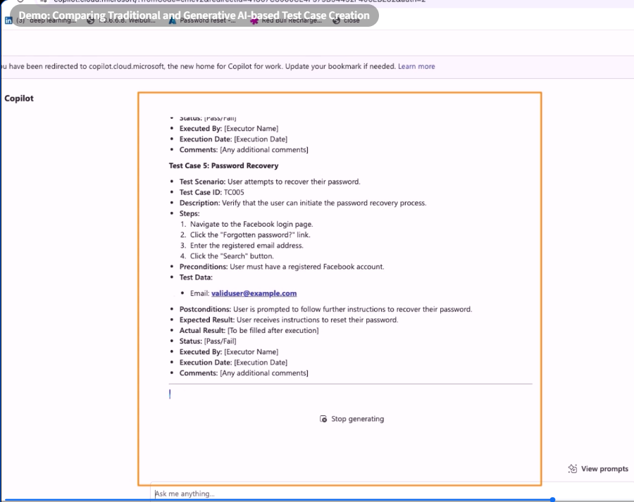

# Demo: Comparing Traditional and Generative AI-based Test Case Creation



```txt
your task is to create a detailed set of test cases for evaluating the functionality of the Facebook login page. The project name is Facebook, and it
fosuses on the login module. Your prompt should include fields such as project name, module name, created by, creation date, reviewed by, and
review date. Outline the structure of the test cases, encompassing both positive and negative scenarios to cover various login situations,
including successful logins, invalid credentials, and error message handling. Each test case should adhere to a structured format, including test scenario, test case ID, description, steps, preconditions, test data, postconditions, expected and ancual results, status, executed by, execution date,
and any additional comments. Aim for clarity and detail in your documentation to ensure thorough testing of the Facebook login page.
```



```txt

add the above response in csv format

```