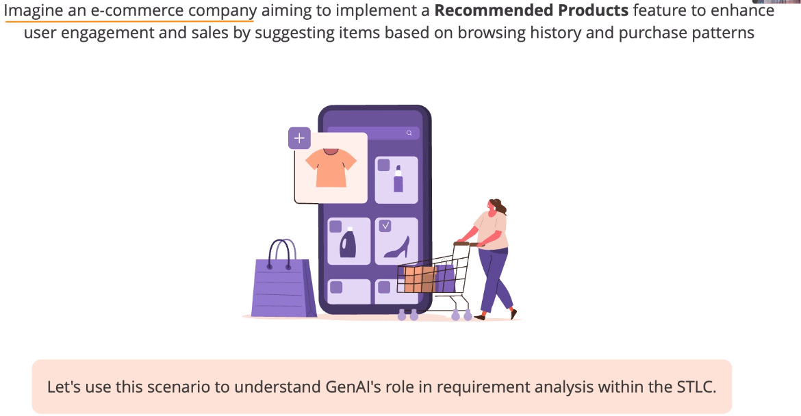
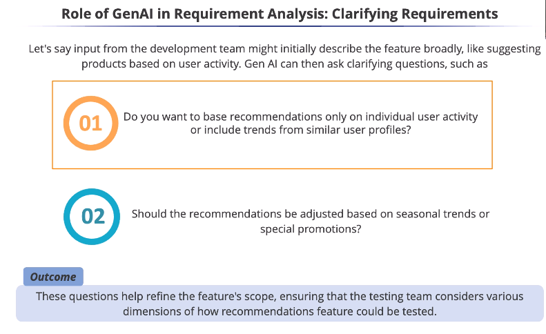

# Requirement Analysis in STLC

> 1st Question

Recommendations based only on individual activity are
limited to personal browsing and purchase history.

Including trends from similar user profiles helps
the system recommend items based on shared
age, location, and shopping habits.

Testing similar user profiles is crucial to ensure
accurate grouping and relevant recommendations.

> 2nd Question

Should recommendations adapt to seasonal
trends and popular holiday items?

If there is a big sale, should the recommendations
prioritize discounted items for testing?

If these dynamic recommendations work, such
questions from generative Al are incredibly valuable.

* Clarifying requirements upfront
ensures the right things are tested.
* It is essential to have a clear understanding of
what is being built and tested from the start.