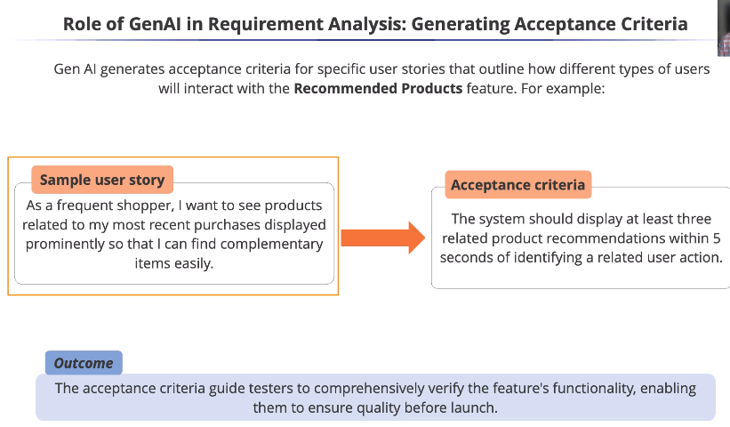
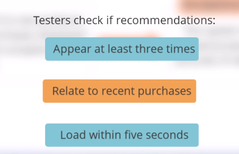
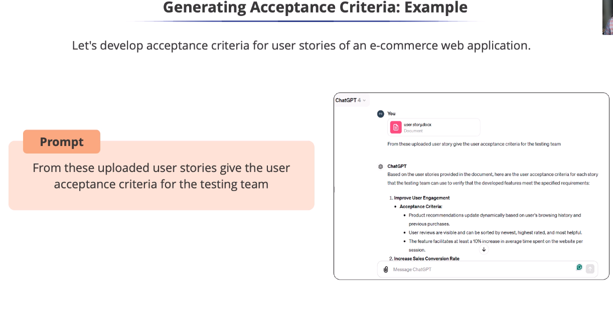

# Role of GenAI in Requirement Analysis: Generating Acceptance Criteria

* Acceptance criteria might sound technical,
but they are vital for ensuring alignment on
what done means for a feature.
* Features are often described using user
stories to provide a clear perspective.

* Acceptance criteria act as a checklist to
confirm if the user story has been
successfully implemented
* Generative Al helps us by automatically generating
acceptance criteria based on user stories.

* It is not just about the recommendations appearing, but also how quickly they show up
after a user interacts, like viewing a product or adding it to the cart.

* Practical example

* Suppose a document is received that contains user
stories about recommended products and other
sections of the e-commerce site.

> Prompt
> From these uploaded user stories give the user acceptance criteria for the testing team

This example clearly showcases the power of
generative Al in action.

This saves testers time and effort in requirement analysis,
enabling focus on complex testing and ensuring the
software meets user and business needs.