# Demo: Analyzing Requirements Using GenAI

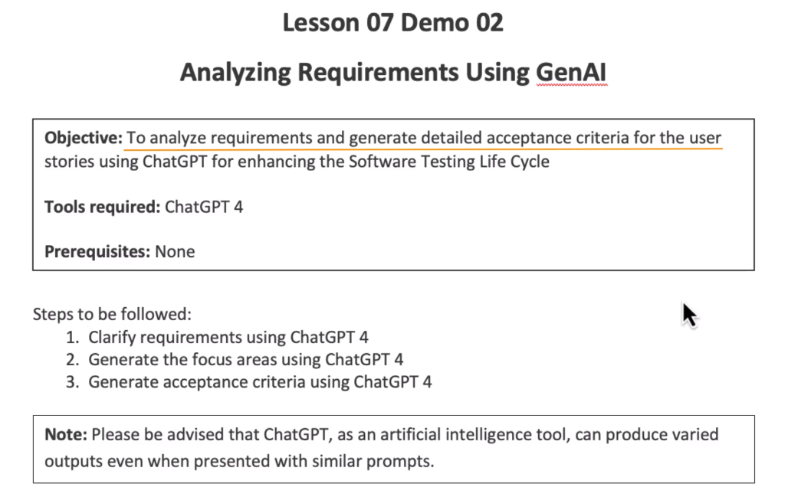

> Setting context

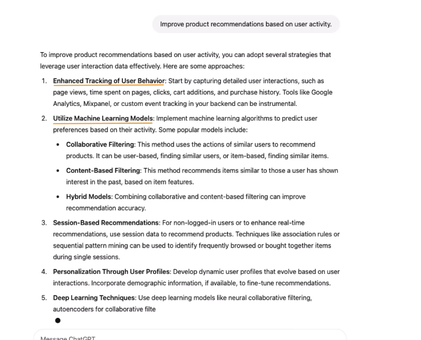

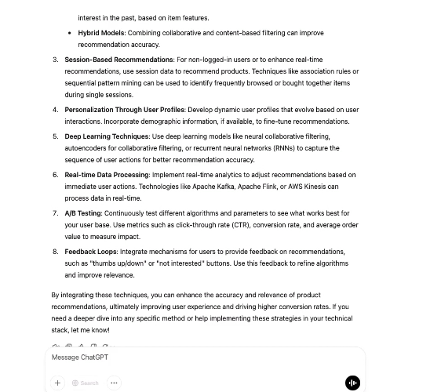

> Now giving a clarification prompt

* Given the requirement to improve product recommendations based on user activity, what specific questions should I ask the development team to clarify this requirement?

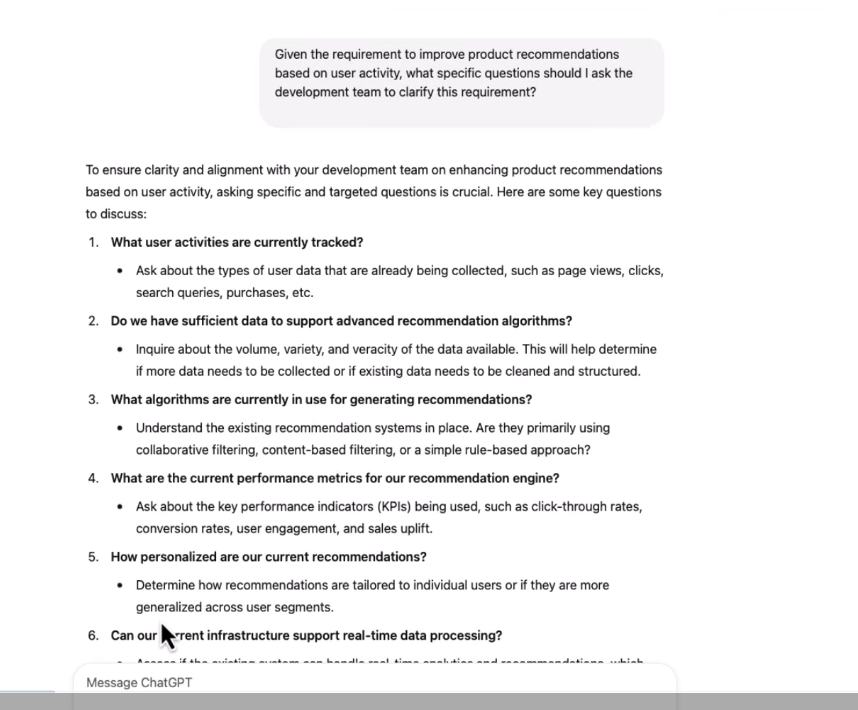

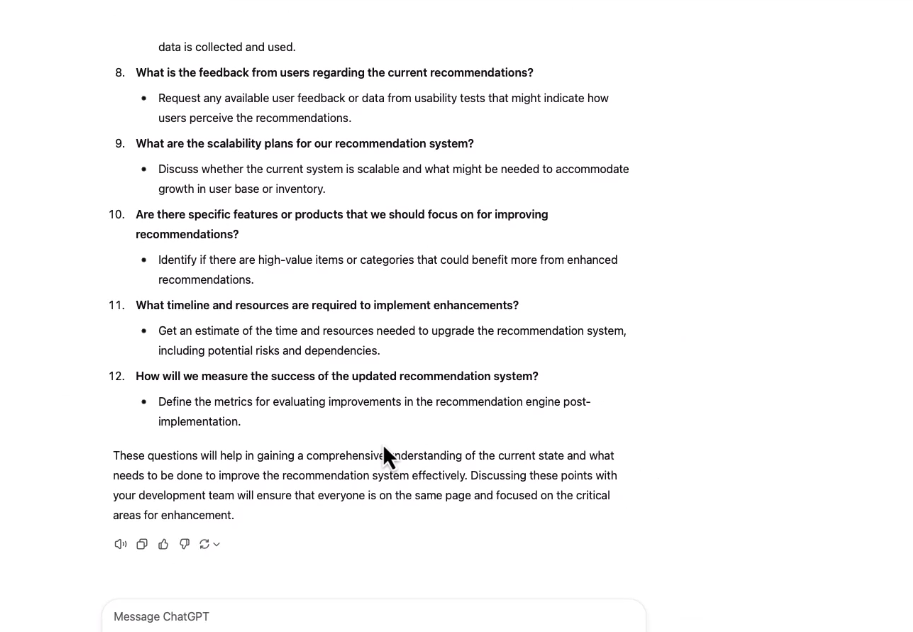

> Now we will give our new prompt

```txt
Based on the previous discussion where we identified the need to clarify the initial requirement of
improviga product recommendations based on user activity, here are two specific questions:

What specific user activities are currently tracked that could influence product
recommendations?

What additional user activity data do we need to improve the recommendations?

Could you help draft a more detailed requirement that addresses these points? Please include
any assumptions or conditions that might affect the implementation of these features.
```

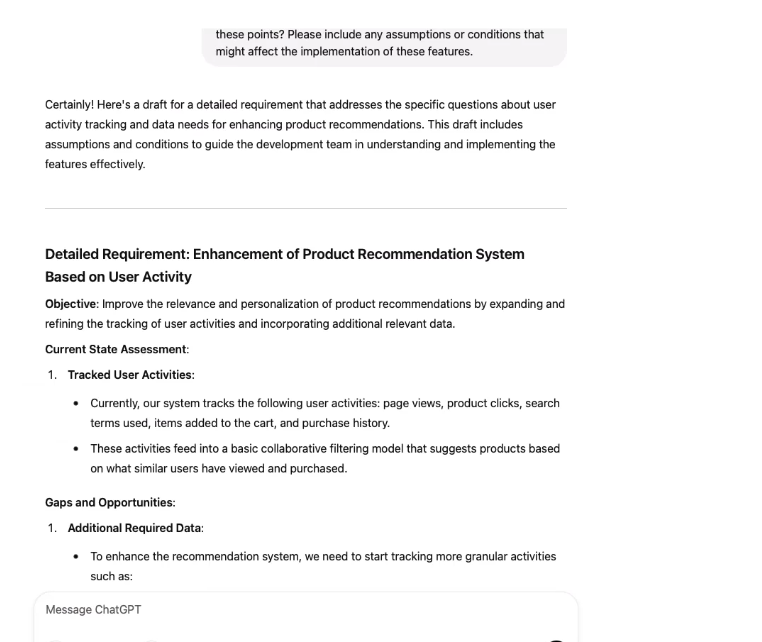

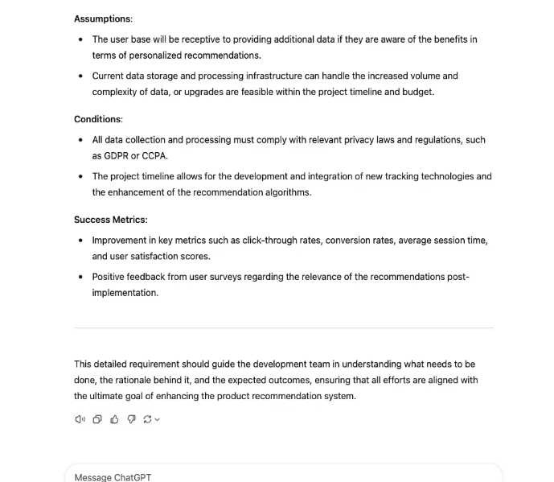

> uploading the file


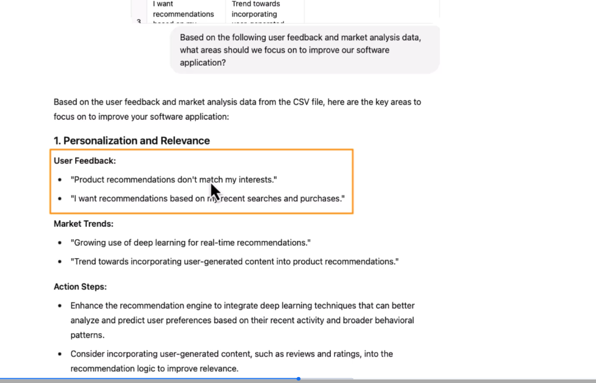

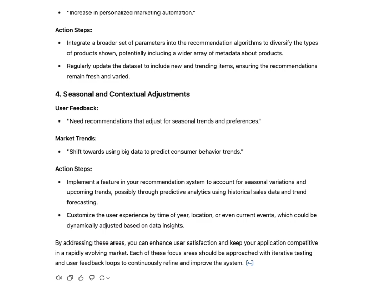

> Now we will ask to adjust the priority or deprioritize or prioritize ​our recommendations and focus on a key area. 
> Prompt

```txt
Given the recommended focus areas to enhance our recommendation engine with deep learning,
expand data analytics, and improve personalization and variety, how should we adjust our
software development and testing priorities to best implement these improvements efficiently
and effectifely?
```

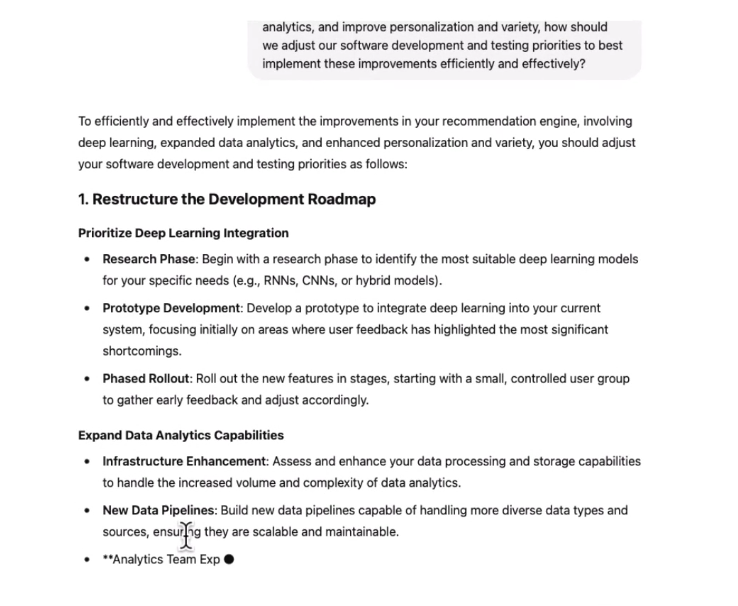

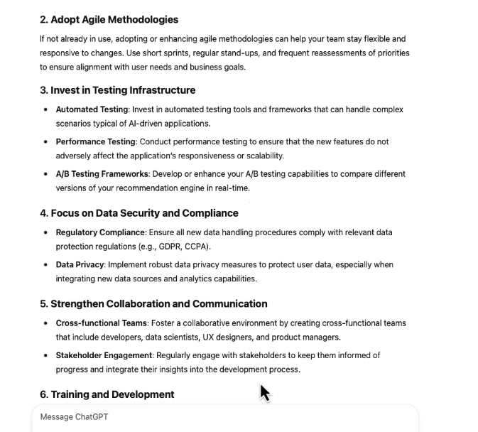

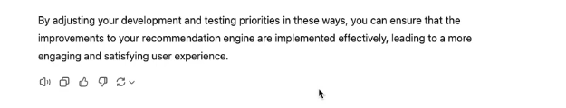

> Now we will upload our user story to get acceptance criteria
> Prompt

```txt
what should be the acceptance criteria for this user story to ensure it meets the user's needs?
```

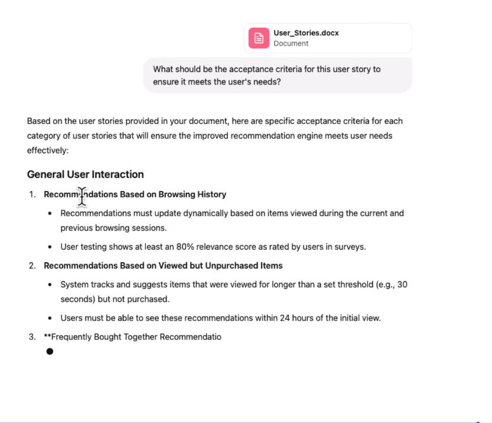

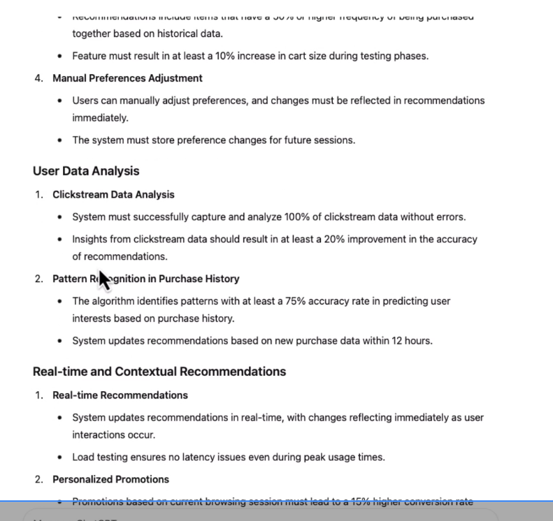

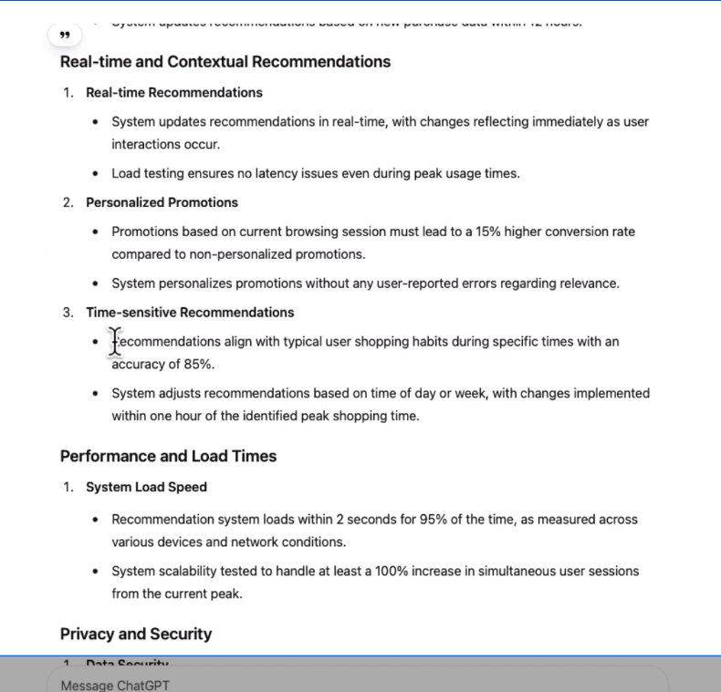

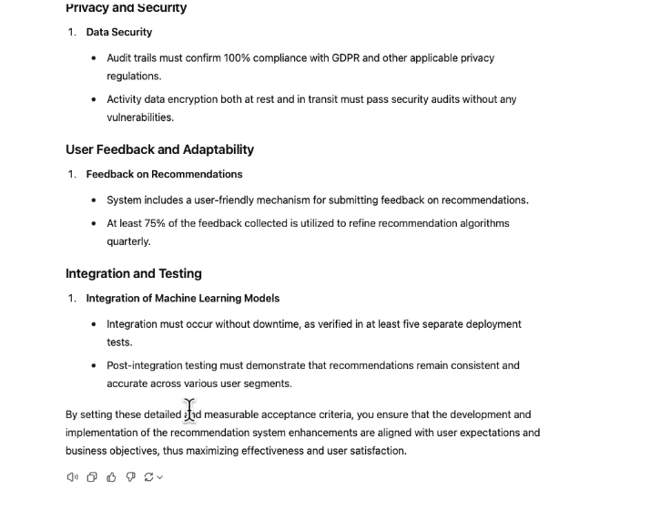