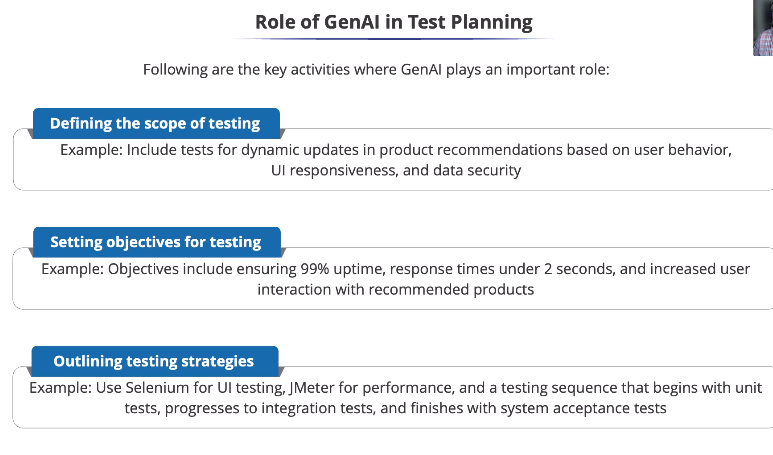
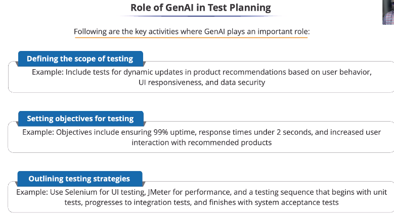
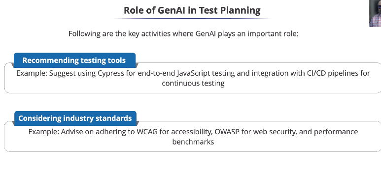
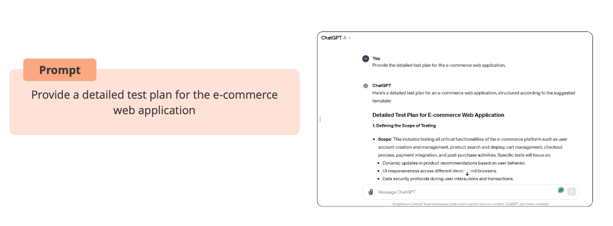

# Role of GenAI in Test Planning

> test planning is all about ​creating the roadmap for our testing journey

* In task planning, Generative Al serves as a
strategic advisor, defining scope, setting
objectives, and outlining strategy impact.

* It is about ensuring a robust, efficient test plan
that ensures product success.

* GenAI recommends tools suited for the project
and compatible with modern workflows.
* Software testing follows industry standards and best
practices for accessibility, security, and performance.
* GenAl can prompt you to test for elements like keyboard
navigation, screen reader compatibility, and color contrast.
* GenAl can suggest security testing practices based on OWASP
recommendations, helping protect against common web vulnerabilities.

## Test Planning - Example

* Test plan for the e-commerce web application

* A strong test plan starts by identifying key areas to test,
considering various types of testing such as functionality, UI,
and security, and providing specific examples for each area.

* GenAl quickly provides a structured, comprehensive draft, eliminating
the need to spend hours drafting a test plan from scratch.

* Note: The plan still requires human review, refinement, added
specifics, and customization to meet the project's exact needs.

* This example shows how generative Al can accelerate test planning,
improving efficiency and ensuring no crucial aspects are missed.