# Demo: Optimizing Test Planning for Healthcare Analytics Platform Using GenAI

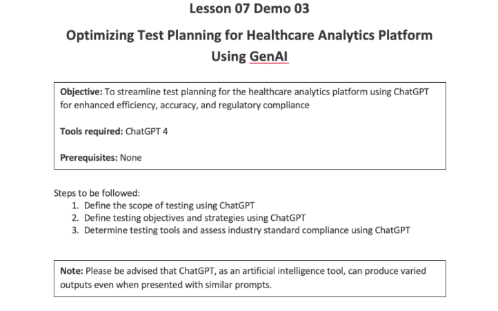

> Prompt

```txt
The following are the project details for your reference:
Project details:
Project name: MediTrack
Description: A healthcare analytics platform providing real-time insights into patient data
Scope of testing:
Dynamic updates in data analytics
UI responsiveness
API security
Stakeholders: Development team, QA team, Project manager, Healthcare providers
Timeline: 4 months
```


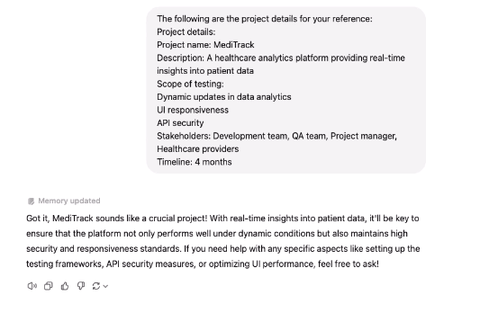

> above is setting the context for GenAI so that later can respond to our queries.
> below is our next instruction

```txt
Our project is a healthcare analytics platform called 'MediTrack' that provides real-time insights
into patient data for healthcare providers. We need to ensure thorough testing across three key
areas:
Dynamic updates in data analytics: How can we ensure that the platform accurately updates
and analyzes patient data in real time to provide actionable insights for healthcare
professionals?
UI responsiveness: What strategies should we employ to test the responsiveness of the user
interface across different devices and screen sizes, considering healthcare providers may
access the platform on various devices?
API security: How can we verify that the APIs used for data integration and exchange are
secure and protected against potential security threats or data breaches?
```

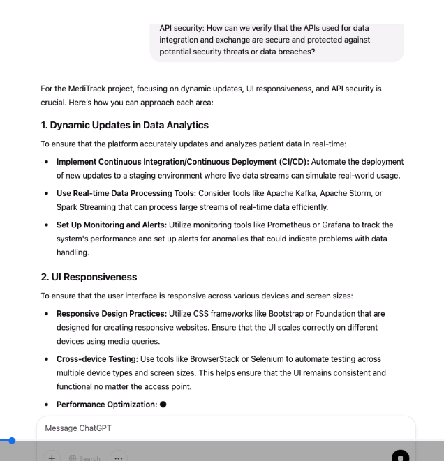

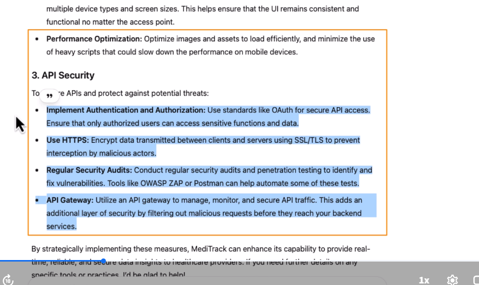

> Next we are going to refine the scope . we will clarify it with the next prompt

```txt
Based on the project details provided, please help me refine the scope of testing. Specifically, I need to ensure coverage for dynamic updates in product recommendations, UI responsiveness,
and data security. What additional details or considerations should I include?
```

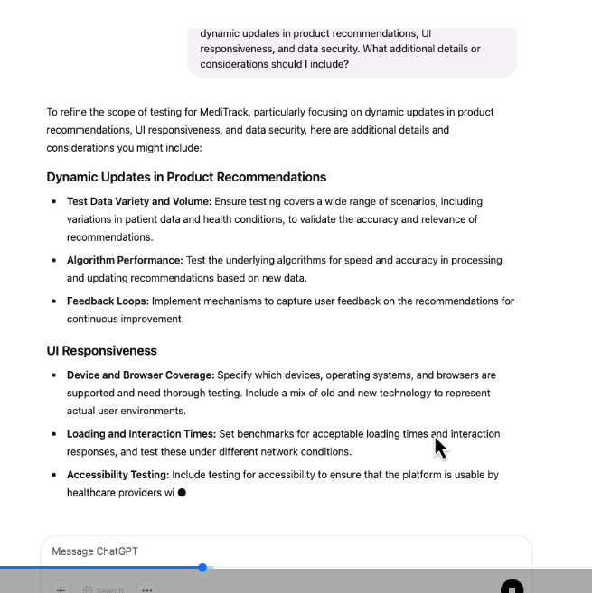

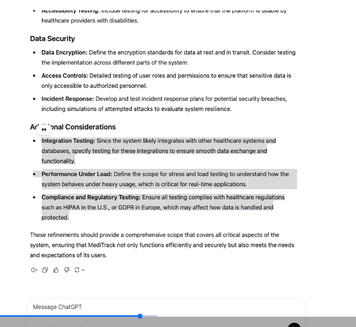

> Now, in the subsequent exercise, we will try to define the testing objectives and strategies.
> Prompt
```txt
Considering the project goals and requirements, what specific measurable objectives should we set for the testing phase? Examples could include uptime, response times, and user interaction metrics. Please provide measurable targets for each objective.
```

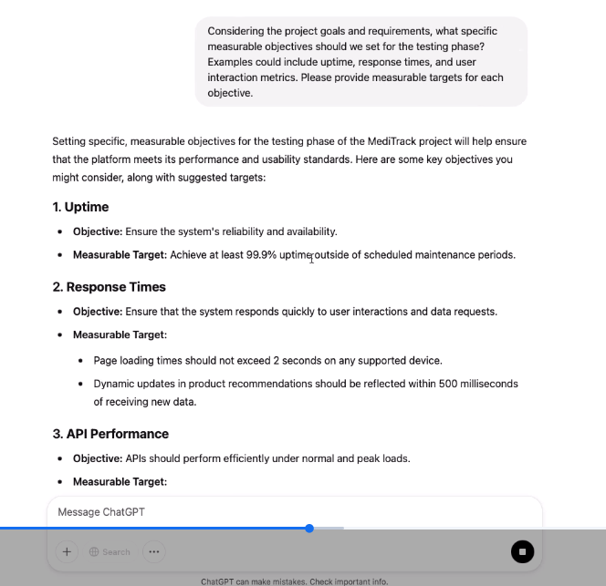

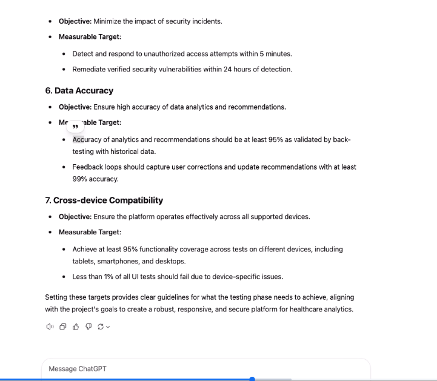

* ​Now, what we will do is, we will send the next prompt to align with overall project goal that meets stakeholders' expectation


> Prompt
```txt
Before finalizing the testing objectives, let us ensure they align
wit. the overall project goals and meet stakeholder expectations.
Are there any additional objectives or adjustments needed to
ensure alignment with project objectives and stakeholder
expectations?
```

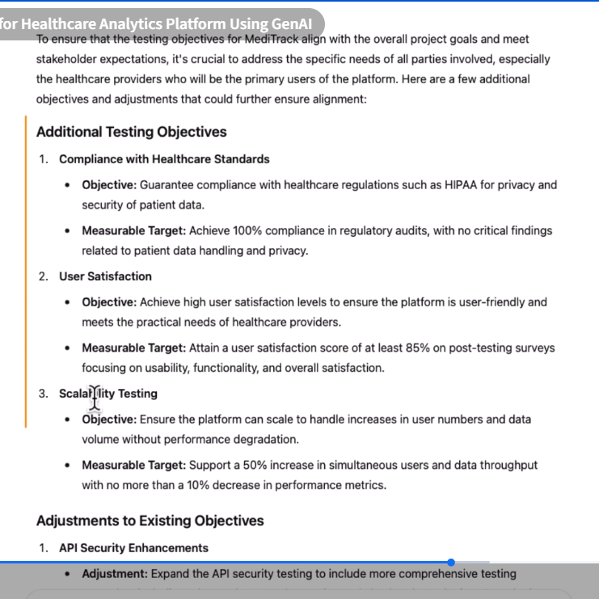

so this is how it is updated our previous details.


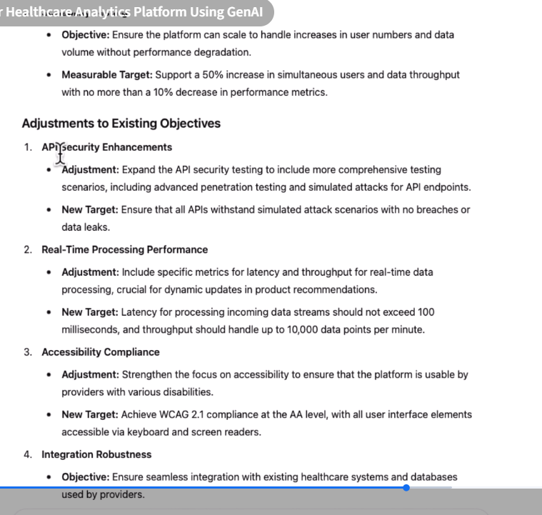

> Now we will also define the strategies with the following

```txt
Considering the defined scope and objectives, what testing
strategies would you recommend for ensuring comprehensive
coverage and efficient testing?
```

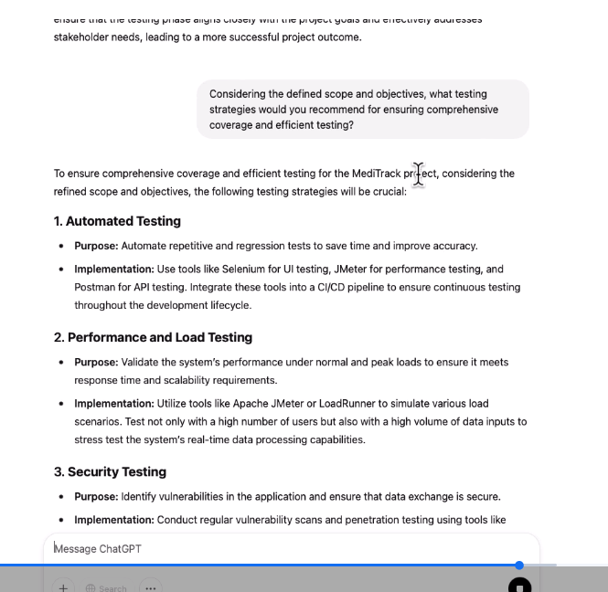

> Now, in the third step, we need to determine the testing tools, assessing industry standard compliance

```txt
Given the project requirements and objectives, please suggest testing tools that would be most
suitable. Factors to consider include compatibility with our technology stack, efficiency, and
seamless integration with our CI/CD pipelines.
```

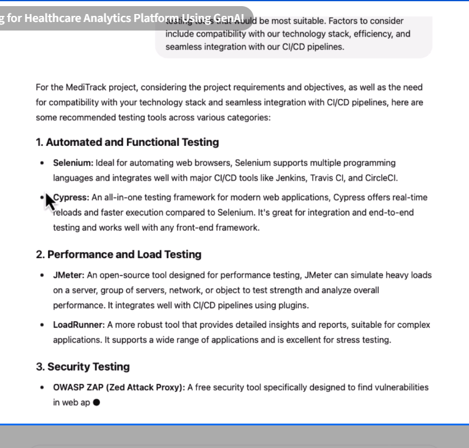

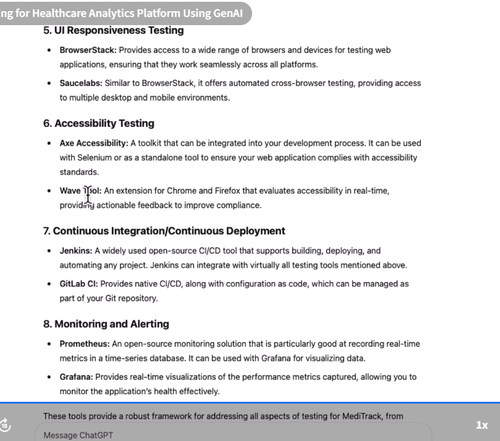

> So, the next prompt, you know, to assess compliance with industry standards. ​So, we have to assess those compliances.
> Prompt

```txt
For our project in healthcare, what industry standards and
benchmarks should we adhere to in terms of accessibility,
security, and performance? Please provide guidance on ensuring
compliance with these standards.
```

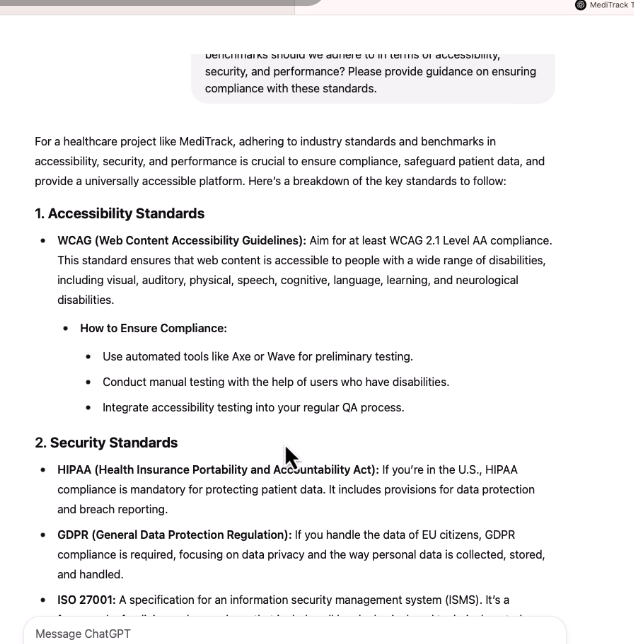

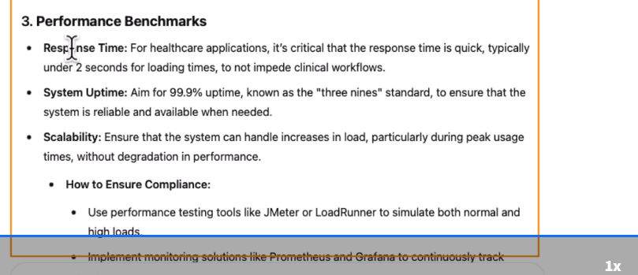

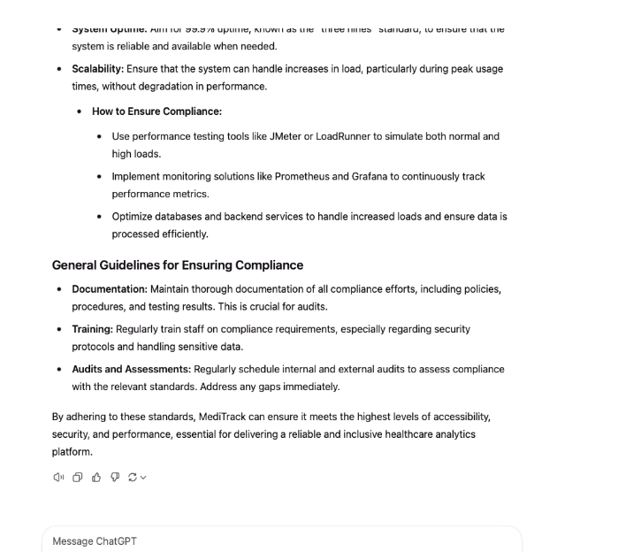

> So, by following these steps and using these prompts, we have successfully optimized test planning for the healthcare analytics platform to ensure enhanced efficiency and compliance with the industry standard