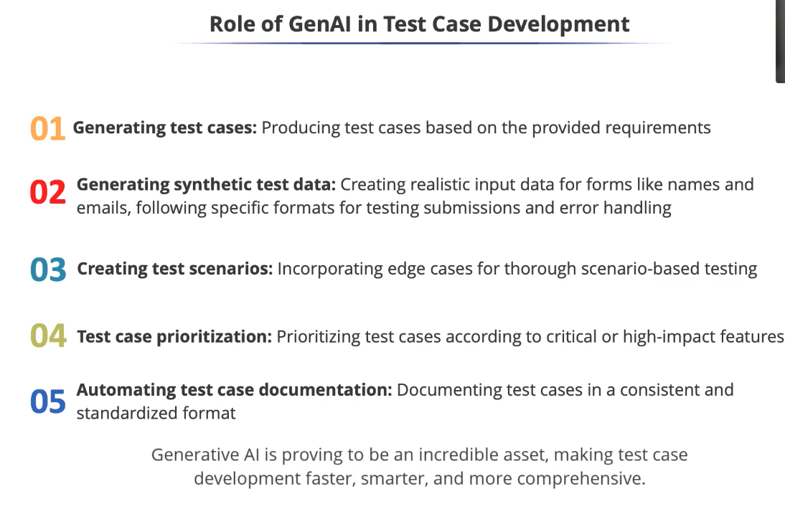

# Role of GenAI in Test Case Development

* Edge cases are unusual or extreme situations that can often break software.
* Generative Al excels at thinking outside the box, creating diverse test scenarios,
including tricky edge cases for recommended products.
* Generative Al helps test more broadly and ensures robustness.
* Test case descriptions, steps, expected results can be generated and linked to
requirements, making test documentation more organized and easier to maintain.
* Generative Al is like a multi-talented assistant, helping with writing test
cases, generating data, prioritizing tasks, and automating documentation.