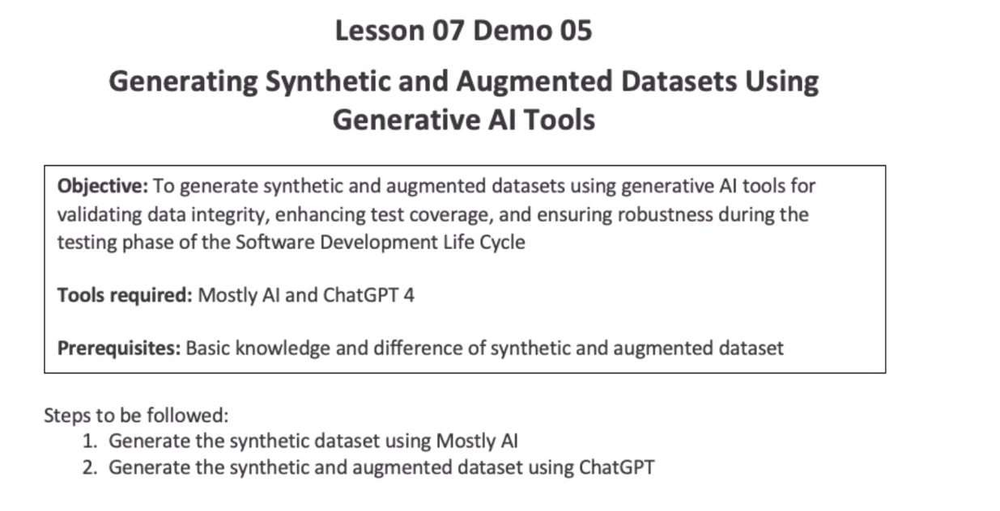
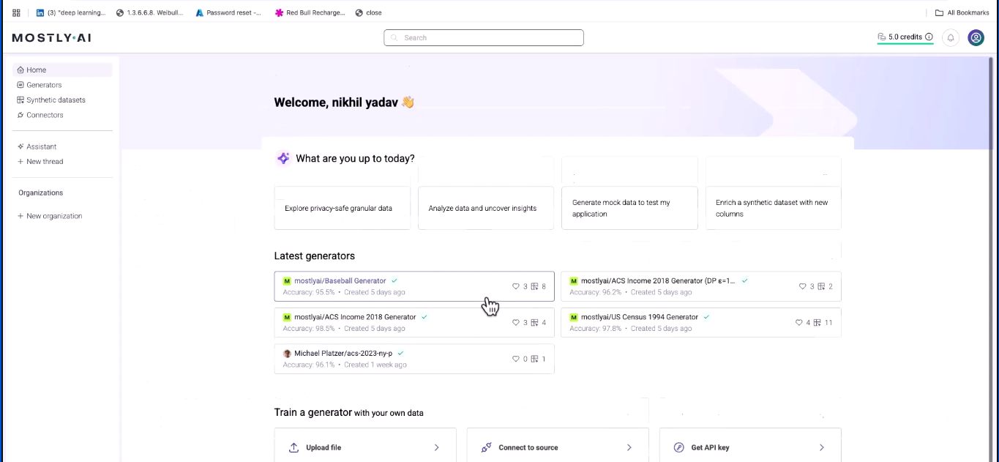
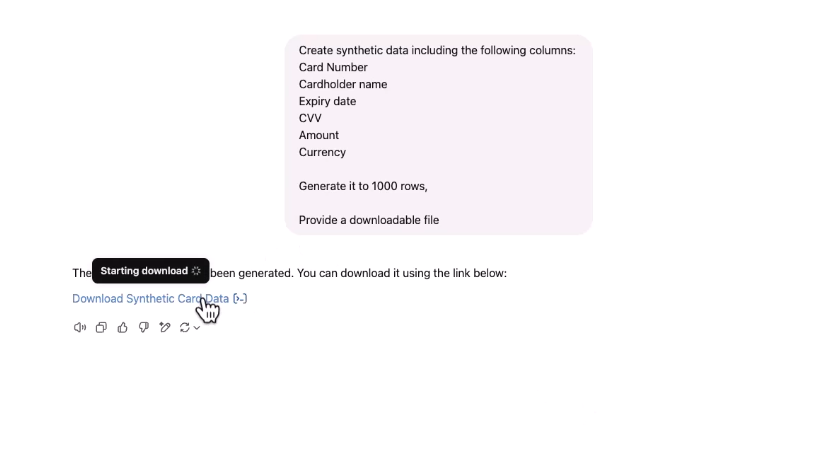
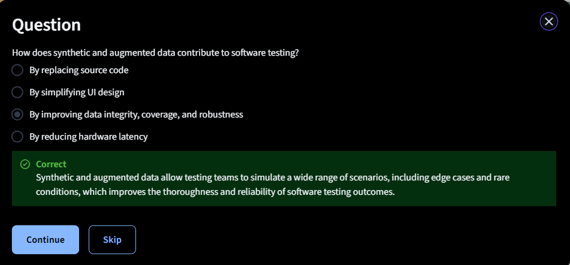

# Demo: Generating Synthetic and Augmented Datasets Using Generative AI Tools

Website - mostly.ai

> Prompt

Create a dataset of 100 rows for a list of mobile phones, including
year of launch, model, price, country, camera configuration, and
discount offer. return the output in csv

* Augumented data is better as increase coverage and robustness

