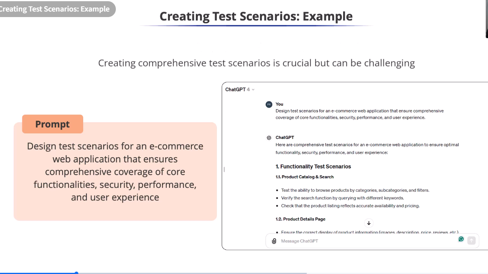

# Creating Test Scenarios: Example

Prompt - 

Design test scenarios for an e-commerce
web application that ensures
comprehensive coverage of core
functionalities, security, performance,
and user experience

* GenAl can generate similar
scenarios covering different
aspects of the application.
* It helps plan testing more effectively
and achieve better coverage