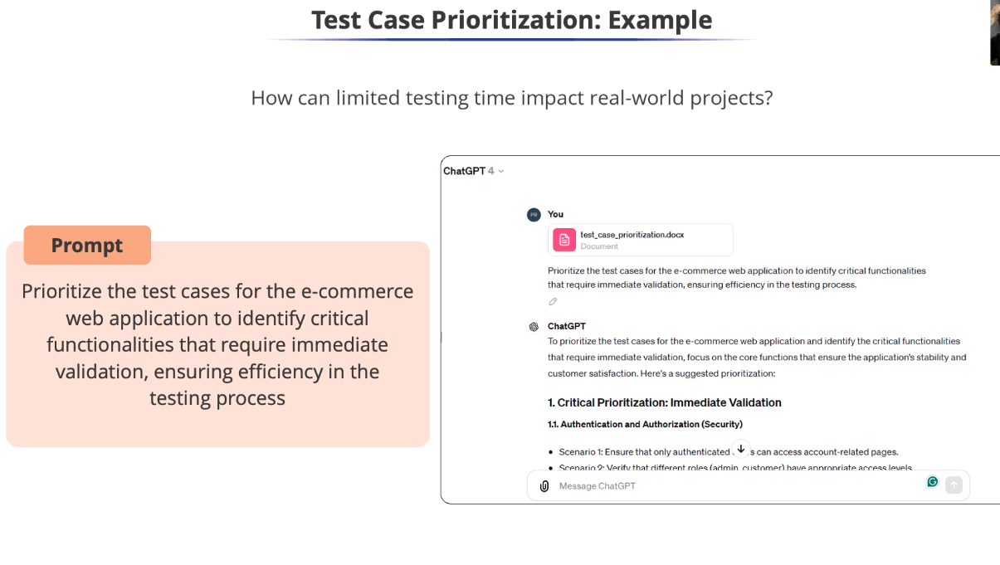

# Test Case Prioritization: Example

* It is the process of identifying the most
critical test cases and executing them first.
* Asking ChatGPT for key test
cases for the e-commerce site
* Why is authentication
prioritized over authorization?
* To secure user accounts and restrict access
to sensitive information.
* GenAl quickly identifies critical areas for
immediate testing
* It makes the testing process more efficient
and effective.
