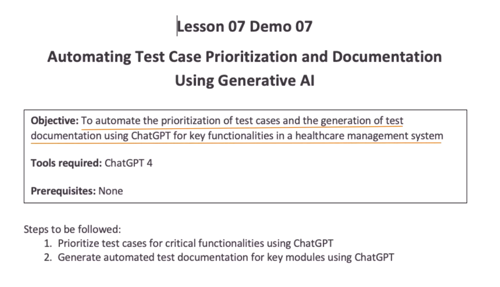
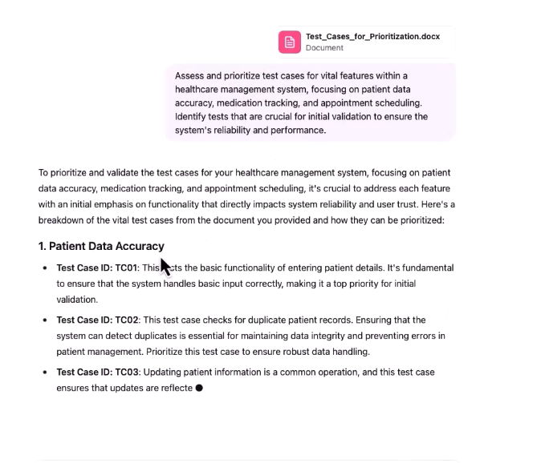
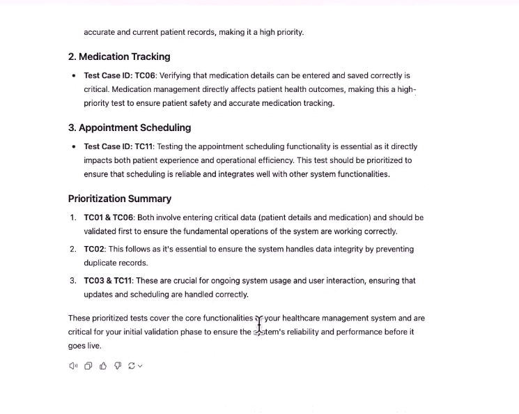
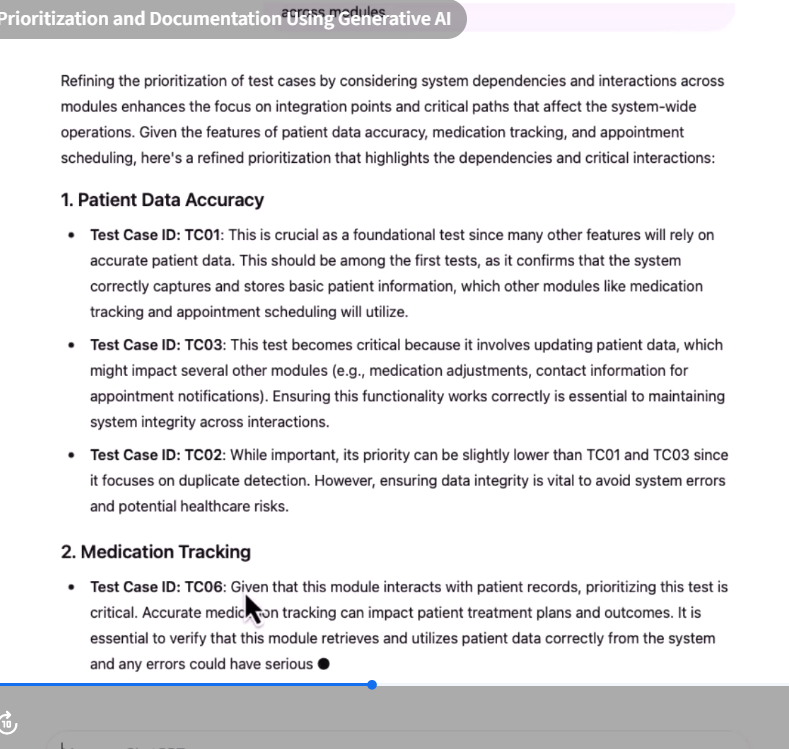
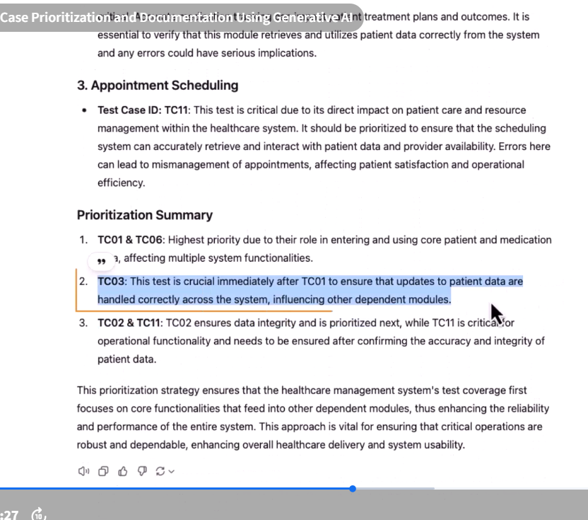
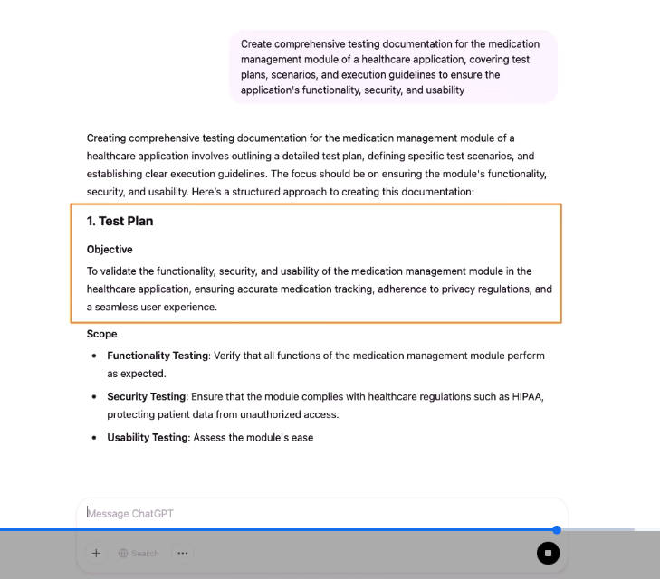
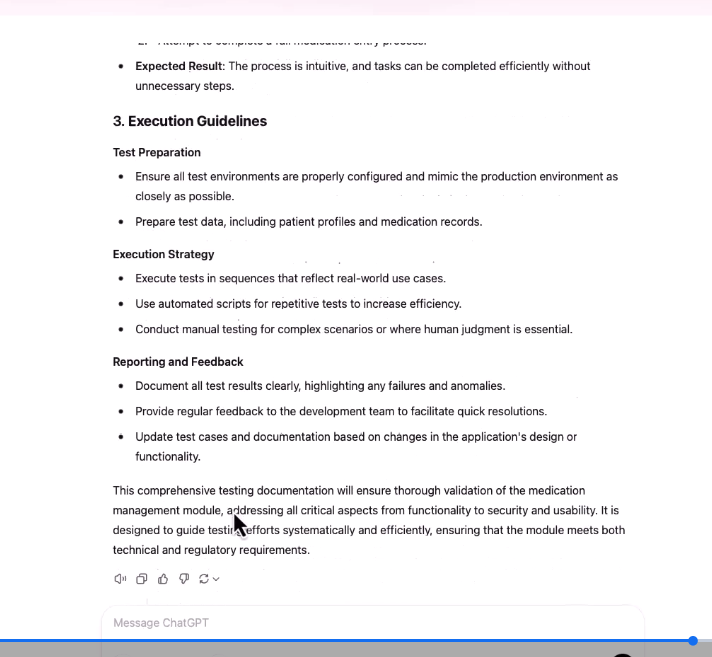
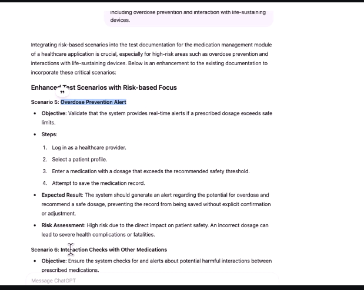

# Demo: Automating Test Case Prioritization and Documentation Using Generative AI



* First upload the test cases and give prompt

```txt
Assess and prioritize test cases for vital features within a healthcare management system,
focusing on patient data accuracy, medication tracking, and appointment scheduling. Identify
tests that are crucial for initial validation to ensure the system's reliability and performance.
```





> Now we will refine

So let's say we are giving here is refine the prioritization of test cases by considering ​system dependencies and interaction with other modules. ​Like the cases that are critical, due to their impact on system wide operations, particularly ​for features that integrate patient data across modules.

```txt
Refine the priortization of test cases by considering system dependencies and interaction with other modules. Highlight cases that are critical due to their impact on system-wide operations, particularly for features that integrate patient data across modules.
```



2nd time TC3 is more priortized then previous one



* Documentation part

```txt
Create comprehensive testing documentation for the medication management module of a
healthcare application, covering test plans, scenarios, and execution guidelines to ensure the application's functionality, security, and usability
```




> Now we also want to incorporate risk based scenario into our documentation

```txt
Integrate risk-based scenarios into the test documentation for the medication management
module. Focus on scenarios that address high-risk areas such as life-critical functionalities, including overdose prevention and interaction with life-sustaining devices.
```

