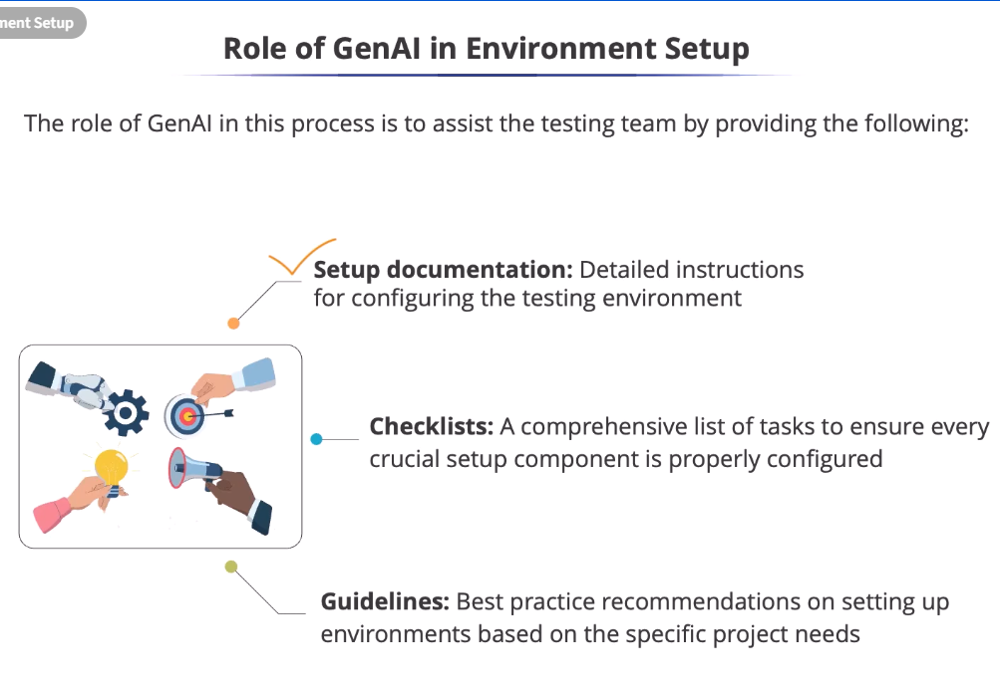
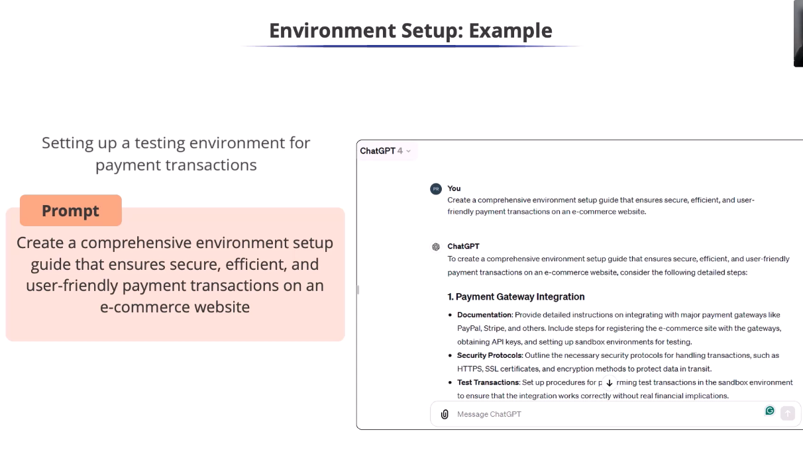
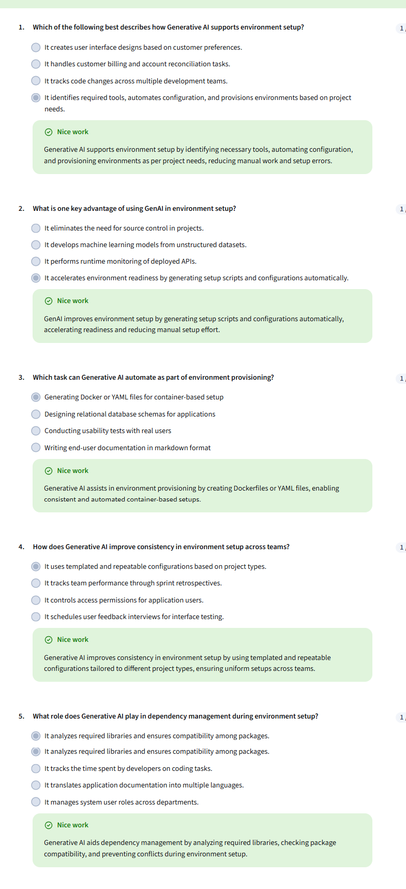
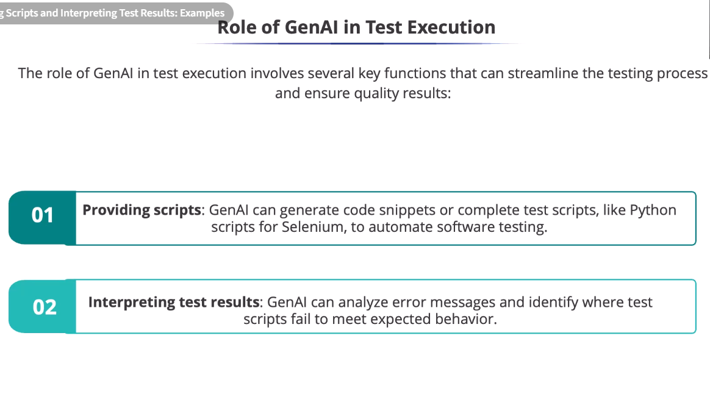
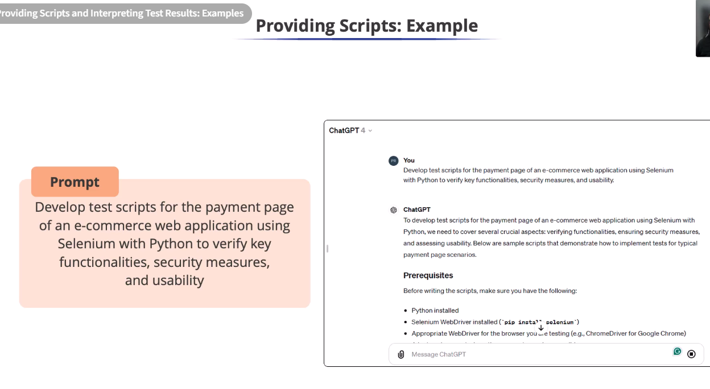
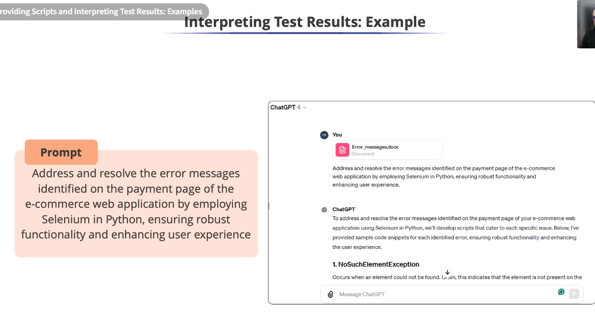

# Role of GenAI in Environment Setup

## Quiz on GenAI-Powered Environment Setup

## Providing Scripts and Interpreting Test Results: Examples

* Writing Python scripts requires
time and coding skills
* This accelerates automation and
simplifies the process for testers
* GenAl can help interpret the
meaning of the error

* Example

* Understanding the goal is key, and
it starts with prerequisites.
* ChatGPT first ensures the required
setup before running Selenium scripts.
* This shows Generative Al is
more than a code generator.

* Interpreting Test results

* Debugging and figuring out the root cause
of these errors is time-consuming.
* The ChatGPT response focuses on a
specific error.
* Selenium testing indicates that the
element is not currently present on the
page when attempting interaction.
* In web automation, Selenium interacts
with elements on a web page, such as
buttons, text fields, and links.
* The element may actually be missing from
the page, loading slowly, or the script might
be searching for it in the wrong location.
* It saves time and simplifies
test result analysis.
