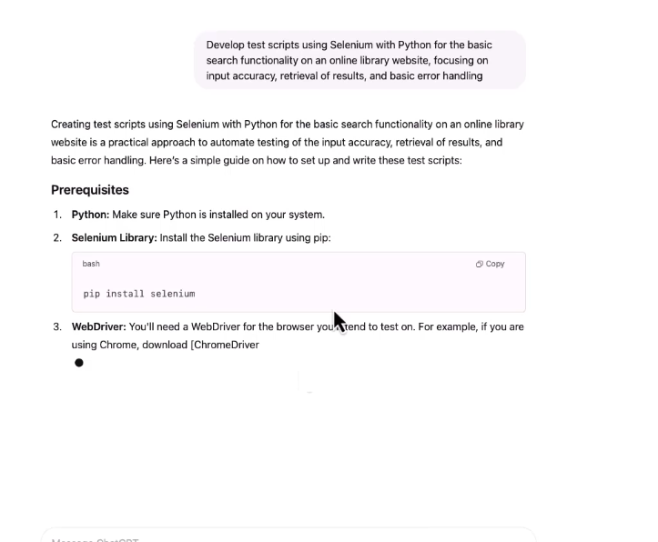
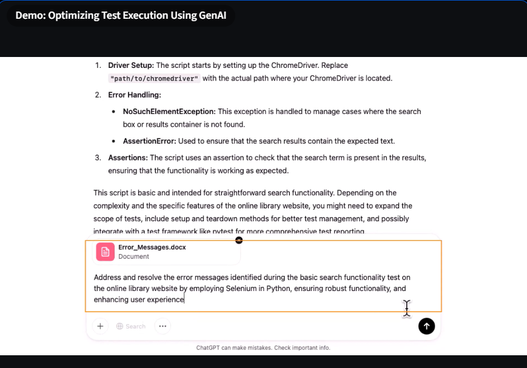
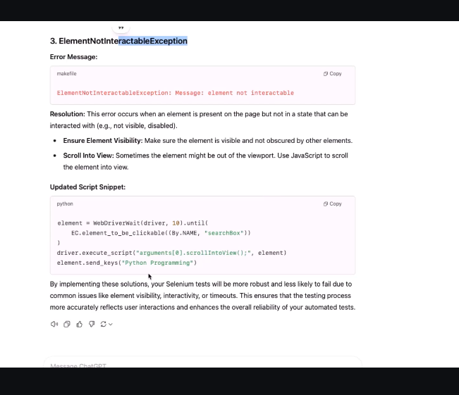

# Quiz on GenAI-Powered Environment Setup


# Demo: Optimizing Test Execution Using GenAI




> Identify error messages



```txt
Address and resolve the error messages identified during the basic search functionality test on
the online library website by employing Selenium in Python, ensuring robust functionality, and
enhancing user experience
```

