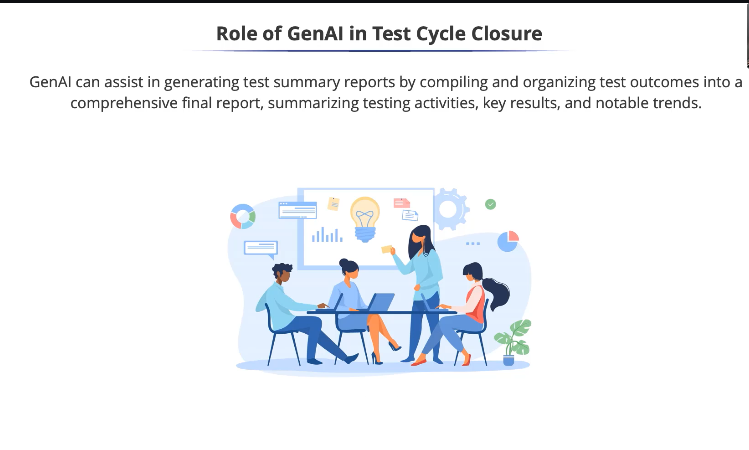
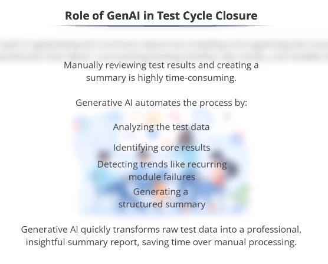
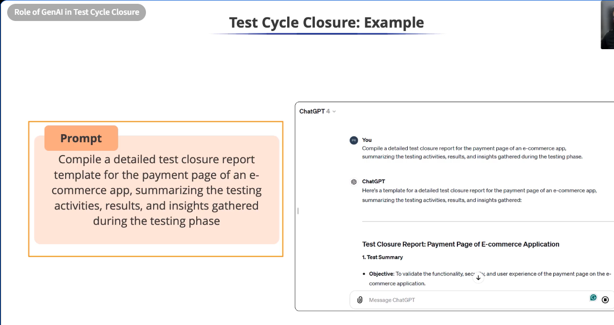
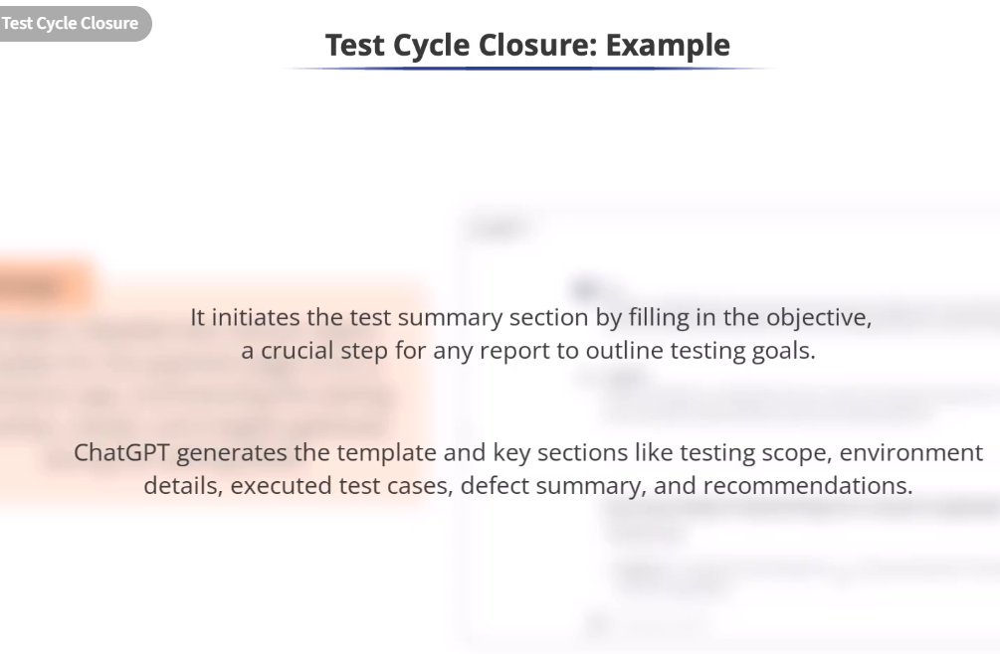

# Role of GenAI in Test Cycle Closure



* Gather data, compile test results, analyze trends, and
present them clearly and organized.
* Automate, compile, and organize all test outcomes, including
tests that passed and those that failed.



* Example
Prompt - 

```txt
Compile a detailed test closure report
template for the payment page of an e-
commerce app, summarizing the testing
activities, results, and insights gathered
during the testing phase
```



