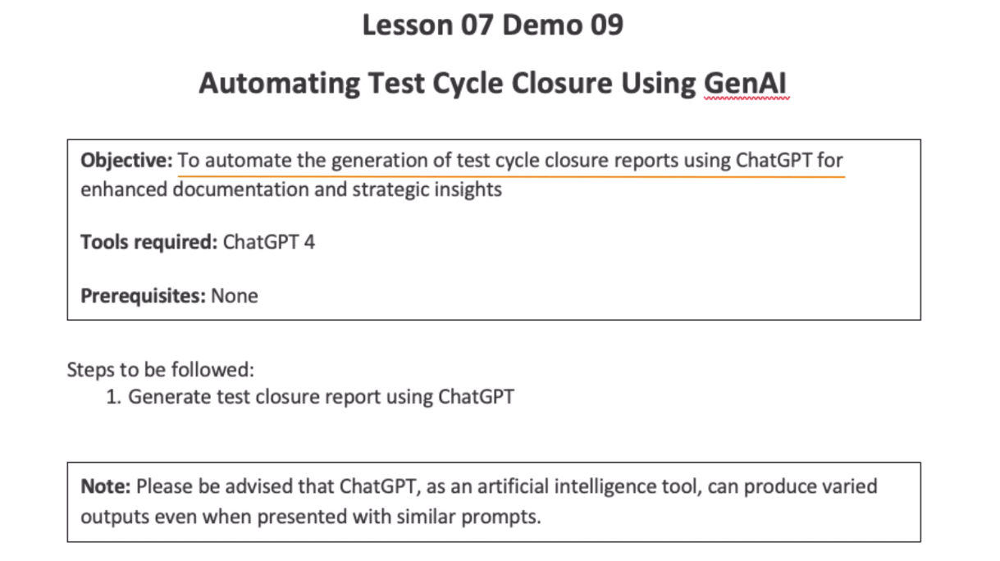
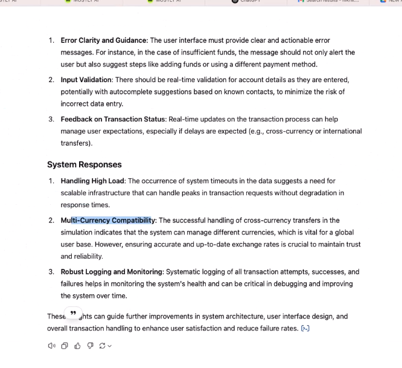
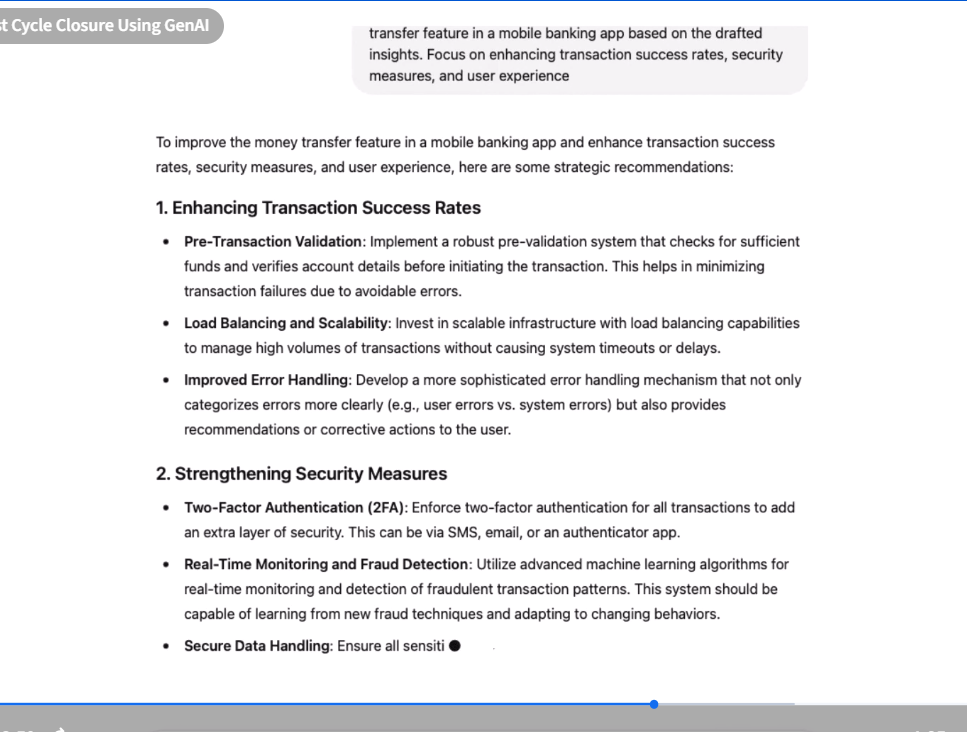
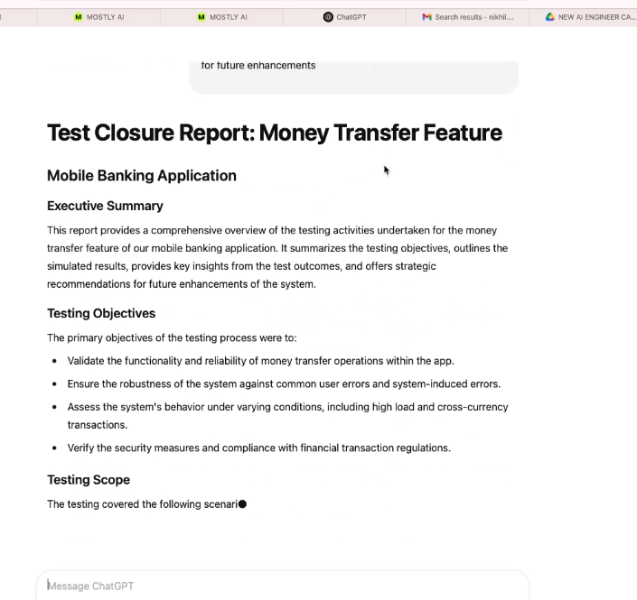
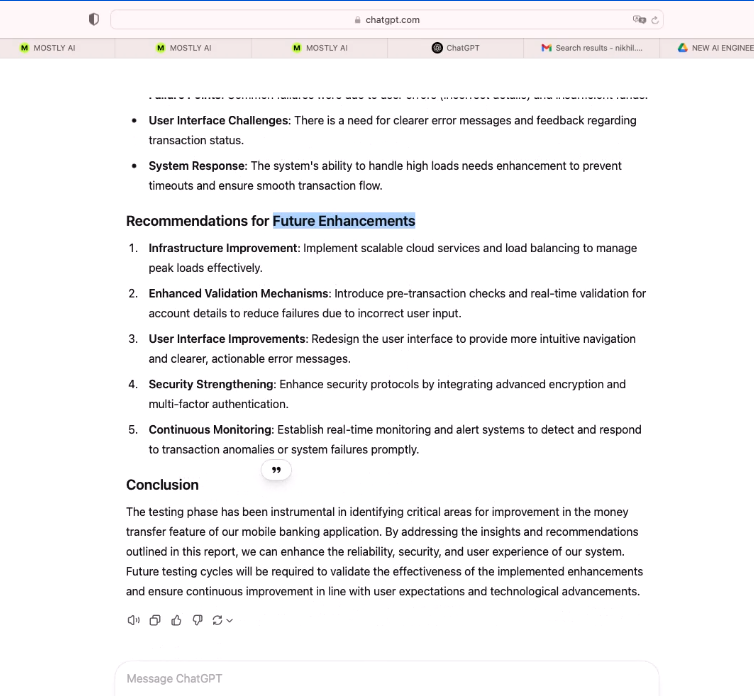

# Demo: Automating Test Cycle Closure Using GenAI



Prompt - 
we will analyze our test case (Mobile banking transactiond data)

```txt
Analyze the document and based on the simulated test data for the money transfer feature, draft
hypothetical insights about common failure points, user interface challenges, and system
responses.
```
Response - 



```txt
Create strategic recommendations for improving the money transfer feature in a mobile banking
app based on the drafted insights. Focus on enhancing transaction success rates, security
measures, and user experience
```
Response - 



> Now we have to create test closure report

```txt
Compile a test closure report for the money transfer feature of a mobile banking app. The report
should summarize the testing objectives, simulated results, key insights, and recommendations
for future enhancements
```



