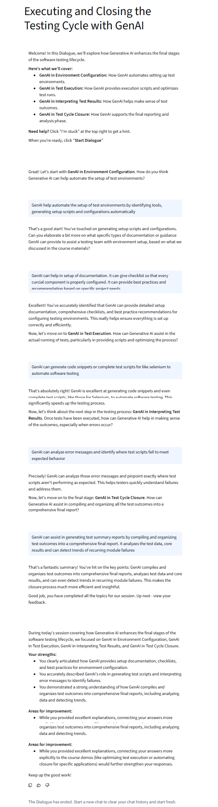

# Executing and Closing the Testing Cycle with GenAI

Welcome! In this Dialogue, we'll explore how Generative AI enhances the final stages of the software testing lifecycle.

**Here's what we'll cover:**
*   **GenAI in Environment Configuration:** How GenAI automates setting up test environments.
*   **GenAI in Test Execution:** How GenAI provides execution scripts and optimizes test runs.
*   **GenAI in Interpreting Test Results:** How GenAI helps make sense of test outcomes.
*   **GenAI in Test Cycle Closure:** How GenAI supports the final reporting and analysis phase.

